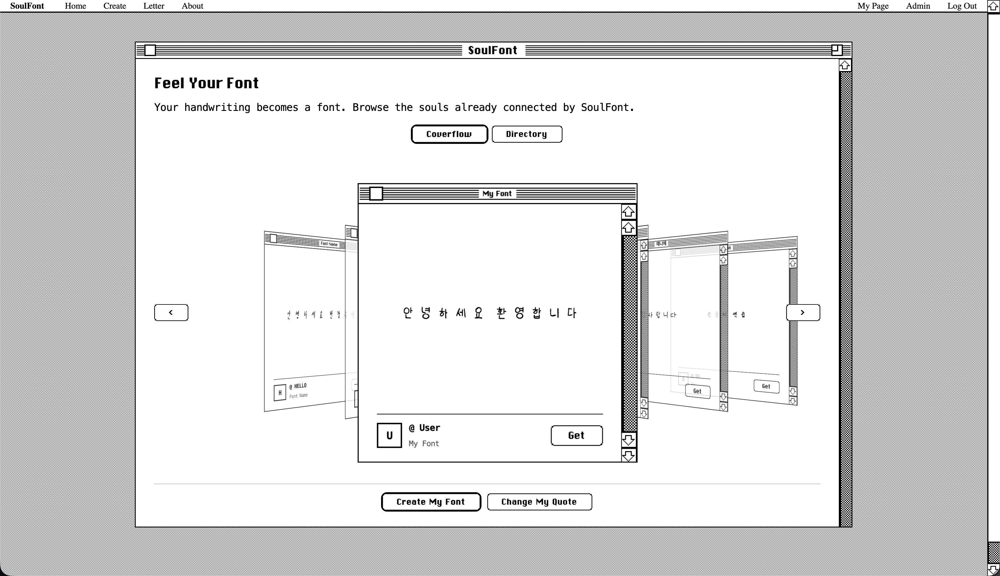

# Soul Font

[](https://www.python.org/)
[](https://www.djangoproject.com/)
[](https://pytorch.org/)

Soul Font is a Django web application for creating a personal Korean handwriting font from a completed PDF handwriting template. The app accepts a user's template upload, crops and cleans the glyph samples, runs the handwriting model for Hangul generation, traces the generated glyphs into curve outlines, and saves a downloadable TTF font.



## Demo

Watch the demo video: https://www.youtube.com/watch?v=X25yWyhzacM

## What is in this repository

```text
soulfont/
  manage.py
  config/       Django settings, root urls, wsgi/asgi
  pybo/         the web app: views, forms, models, templates, routes
  foundry/      the font pipeline, in the order it runs
                  char_layout.py        where each glyph sits in the template
                  font_processor.py     PDF to cleaned glyph rasters, weight variants
                  inference.py          runs the handwriting model
                  glyph_vectorizer.py   rasters to Bezier outlines and a TTF
                  refine_metrics.py     sizes, side bearings, baseline
                  set_font_metadata.py  name/OS2 tables, so weights install as one family
                  generateTTF.js        legacy Node tracer, kept as a fallback
                  crop.py               splits a filled template into cells
  dmfont/       upstream DM-Font training code (not used by the web app)
  models/ datasets/ utils/ meta/
                vendored DM-Font model packages, left flat because their own
                imports expect them at the project root
  workdir/      everything the pipeline generates, one folder per concern
                  crops/<name>/     cells cut out of the uploaded template
                  glyphs/<name>/    what the model drew
                  fonts/<id>/       per-upload build directory
                  configs/<name>.yaml
  data/charset/ Korean target character sets
  static/ media/ checkpoints/ uploads/
```

`workdir/` is entirely generated and gitignored; deleting it costs nothing but a
regeneration. Everything outside it is source.
- `requirements.txt` - compact ML/font-processing dependency list.
- `requirments_d.txt` - full pinned dependency list used by the Django app. The filename is intentionally referenced as it exists in the repo.

## Prerequisites

Install these before starting:

- Python 3.9 or newer.
- Poppler, required by `pdf2image`.
- Node.js and npm — only for the legacy tracer fallback.

On macOS, Poppler can be installed with Homebrew:

```bash
brew install poppler
```

## Required model checkpoint (the one manual download)

The handwriting template (`soulfont/static/templates/28_template.pdf`) and the default
font (`soulfont/media/ttf_files/MaruBuri-Regular.ttf`) are already included in the repo,
so the **only** asset you must download yourself is the model checkpoint (it is too
large to track in Git):

1. Open the DM-Font v1.0.0 release: https://github.com/clovaai/dmfont/releases/tag/v1.0.0
2. Download the pretrained Korean generator weights.
3. Save the file as `soulfont/checkpoints/korean-handwriting.pth` (create the
   `soulfont/checkpoints/` folder and rename the downloaded file to that exact name).

Without this file the web app still runs, but font generation will fail at the
inference step. The app creates the runtime directories it needs
(`soulfont/uploads/`, `soulfont/workdir/`, and additional files under
`soulfont/media/`) automatically as fonts are generated.

## Setup

From the repository root:

```bash
python3 -m venv .venv
source .venv/bin/activate
python -m pip install --upgrade pip
python -m pip install -r requirments_d.txt
```

Optional — the Node dependencies are only needed for the legacy tracer
(`SOULFONT_VECTORIZER=imagetracer`):

```bash
cd soulfont
npm install
cd ..
```

Initialize the Django database:

```bash
cd soulfont
python manage.py migrate
```

Optional: create an admin account.

```bash
python manage.py createsuperuser
```

## Run the development server

From `soulfont/` with the virtual environment activated:

```bash
python manage.py runserver
```

Open the app at:

```text
http://127.0.0.1:8000/
```

Useful routes:

- `/pybo/` - home page.
- `/signup/` - create a user account.
- `/login/` - log in.
- `/create/` - upload a handwriting template.
- `/result/` - view and edit generated font metadata.
- `/admin/` - Django admin.

## Font generation workflow

1. Start the Django development server.
2. Sign up or log in.
3. Download and fill out the handwriting template.
4. Upload the completed PDF from the create page.
5. Choose fast generation for the common 2,350 Hangul set or full generation for the 11,172 Hangul set.
6. Wait for the background pipeline to finish.
7. Open the result/user page to download the generated TTF.

The web pipeline calls:

```text
FontStyleProcessor -> foundry/inference.py -> prepare_trace_images
                   -> foundry/glyph_vectorizer.py -> refine_metrics.py -> set_font_metadata.py
```

- `prepare_trace_images` (in `font_processor.py`) cleans the rasters: it closes the
  generator's pinholes, drops speckle, smooths each outline through its distance field,
  evens stroke width along the stroke, and matches the traced English/symbol glyphs to the
  Hangul's pen weight. Every threshold is a multiple of the glyph's own stroke width rather
  than a fraction of the frame, so a Hangul syllable filling its cell and a lowercase `o`
  sitting small in its own are treated alike.

  The stroke-evening step is worth knowing about: the model draws strokes that swell and
  pinch about a third more than the writer's pen did, and the outline smoothing above makes
  that worse (blurring a distance field thins convex places and thickens concave ones). The
  step smooths the distance field's ridge *along* the stroke, so width evens out while every
  place the pen went stays put. `STROKE_EVENNESS` controls it; 0 turns it off.
- `foundry/glyph_vectorizer.py` traces them: sub-pixel marching-squares contours, shrink-free
  Taubin smoothing, corner detection, and least-squares quadratic Bézier fitting, assembled
  into a TTF with fontTools. About 40% of its points are on-curve, matching commercial
  Korean fonts; the previous tracer emitted 87% straight segments, which is what made
  exported outlines look faceted.
- `foundry/refine_metrics.py` fits the outlines into the em: Hangul gets a shared size and
  proportional advances, Latin a real cap height and baseline, plus the space glyph.

Each upload produces three TTFs — Light (300), Regular (400), Bold (700). The two extra
weights are synthesised from the same prepared rasters by offsetting each glyph's distance
field, and all three are fitted with the measurement taken once on Regular: a weight that
fits itself reads its own thinner strokes as a smaller script and grows to compensate, which
would leave the family's weights at visibly different sizes.

`generateTTF.js` (ImageTracer, Node) is kept as a fallback and is selected with
`SOULFONT_VECTORIZER=imagetracer`. Its own thresholds scale with the input resolution and
can be overridden with `SOULFONT_TRACE_LTRES`, `SOULFONT_TRACE_QTRES`,
`SOULFONT_TRACE_PATH_OMIT`, `SOULFONT_TRACE_BLUR_RADIUS`, and `SOULFONT_TRACE_BLUR_DELTA`.

### Where inference runs

Generation uses the GPU on Apple Silicon and falls back to CPU elsewhere. CUDA works but
stays opt-in (`SOUL_FONT_DEVICE=cuda`) because the check below was only run on Metal.
On an M1 Pro, generating the 2,350-syllable set takes 17s on the GPU against 74s on CPU,
and a whole three-weight family 2min against 3min 10s.

The generated glyphs match: across the full charset the largest per-pixel difference is
2.5e-4 on a [-1, 1] output, and no glyph differs once thresholded. The finished outlines
are not quite bit-identical, because the vectorizer traces the grey image and a difference
that small can still move a contour crossing — about 1.5% of glyphs pick up a point or two
of difference, invisible at any reading size. Two CPU runs give byte-identical fonts, so
`SOUL_FONT_DEVICE=cpu` is the setting to use if you need reproducible output.

Half precision is a different story and is refused on Metal: it is faster again, but the
model's component memory accumulates over 28 style images and fp16 loses enough of the
small contributions to damage every glyph. `SOUL_FONT_FORCE_AMP=1` overrides that if you
want to see it.

Optional tuning:

| Variable | Default | Effect |
| --- | --- | --- |
| `SOULFONT_TRACE_SIZE` | `256` | Minimum grid glyphs are cleaned on. Rasters already larger keep their own resolution. |
| `SOULFONT_STROKE_EVENNESS` | `0.6` | How far stroke width is pulled toward its local average. `0` disables it. |
| `SOULFONT_VECTORIZER` | *(unset)* | Set to `imagetracer` to use the legacy Node tracer. |
| `SOUL_FONT_DEVICE` | `auto` | `cpu` forces CPU inference; `mps` / `cuda` pin a specific device. |
| `SOUL_FONT_FORCE_AMP` | *(unset)* | `1` re-enables fp16 autocast on Metal. Measured to corrupt every glyph. |

## Running the model scripts directly

Training entry point:

```bash
cd soulfont
python dmfont/train.py <run-name> <config.yaml>
```

Inference entry point:

```bash
cd soulfont
python foundry/inference.py <config.yaml> checkpoints/korean-handwriting.pth workdir/glyphs/manual_run
```

The inference config must include style image paths, style characters, target characters, architecture settings, and `language: kor`.

## Troubleshooting

- `ModuleNotFoundError: django`: install the full dependency file with `python -m pip install -r requirments_d.txt`.
- `pdf2image` or PDF conversion errors: install Poppler and make sure it is available on your `PATH`.
- Missing checkpoint errors: place `korean-handwriting.pth` in `soulfont/checkpoints/`.
- `SOULFONT_VECTORIZER=imagetracer` errors: that fallback path needs the Node modules, so run `npm install` inside `soulfont/`. The default vectorizer is pure Python and needs none of them.
- Generated font is missing: check the Django server logs; generation runs in a background thread and writes intermediate files under `soulfont/workdir/`.

## If the working copy lives in iCloud Drive

A single 2,350-glyph run writes tens of thousands of small PNGs, and a checkout with a few
runs behind it can reach ~950,000 files against 679 tracked by Git. iCloud Drive cannot
keep pace with that and resolves the race by leaving conflict copies — `views 2.py`,
`retro 3.css` — scattered through the tree.

`.gitignore` drops any `name 2.ext` conflict copy so one can never be committed, but they
still accumulate on disk. To clear them:

```bash
find . -path ./.git -prune -o -print | grep -E ' [0-9]+(\.[A-Za-z0-9]+)?$' | xargs -d'\n' rm -rf
```

That deletes by filename alone, so check the list before piping it to `rm` — a real file
with a space before its extension would match too.

To stop them happening at all, the working tree has to sit outside iCloud: move the repo
somewhere unsynced, or turn off Desktop & Documents Folders sync. Relocating just the four
generated directories and symlinking them back works, but leaves link icons in Finder.

## Development notes

The default Django settings use SQLite, `DEBUG = True`, and permissive `ALLOWED_HOSTS`, so they are intended for local development. Before deploying, move secrets into environment variables, turn off debug mode, restrict hosts, and configure persistent storage for media, static files, model checkpoints, and generated fonts.
