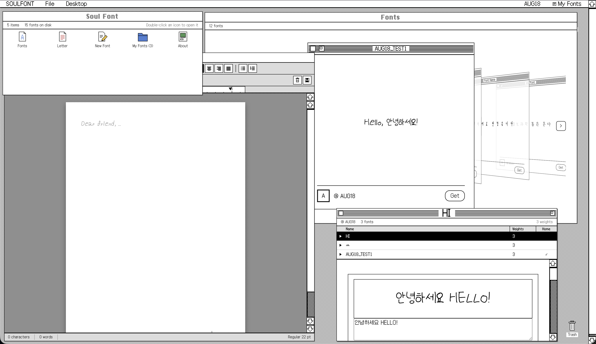

# Soul Font

[](https://www.python.org/)
[](https://www.djangoproject.com/)
[](https://pytorch.org/)

Soul Font turns a filled-in PDF template into an installable Korean font. You hand-write 28
characters, and it generates the rest of Hangul, traces the result into outlines, and gives
you a Light/Regular/Bold TTF family.



Demo: https://www.youtube.com/watch?v=X25yWyhzacM

## Setup

Needs Python 3.9 and Poppler (`brew install poppler`).

```bash
python3 -m venv .venv
source .venv/bin/activate
python -m pip install -r requirements.txt
cd soulfont && python manage.py migrate
```

Then download the pretrained Korean generator from the
[DM-Font v1.0.0 release](https://github.com/clovaai/dmfont/releases/tag/v1.0.0) and save it
as `soulfont/checkpoints/korean-handwriting.pth`. It is too large for Git and generation
fails without it; everything else ships with the repo.

## Run

```bash
cd soulfont
python manage.py runserver      # http://127.0.0.1:8000/
```

The site opens on a System 7 desktop where each application is an icon you double-click.
Sign up, open **New Font**, download the blank template, fill it in by hand and upload the
PDF. The font's own page shows build progress — about two minutes for the common 2,350
syllables — then downloads the family as a zip. From there you can rename it, set author and
licence, or adjust stroke weight and spacing in the editor.

## How it works

```text
crop the template -> generate Hangul (DM-Font) -> clean the rasters
                  -> trace to Béziers -> fit metrics -> write the TTF
```

`soulfont/foundry/` holds that pipeline, one file per step and in that order;
`soulfont/pybo/` is the Django app; `dmfont/` is the upstream model code.
[docs/ARCHITECTURE.md](docs/ARCHITECTURE.md) has the data model, the stages in detail and the disk
layout. Two knobs are
worth knowing: `SOUL_FONT_DEVICE=cpu` forces CPU inference and makes runs byte-reproducible,
and `SOULFONT_STROKE_EVENNESS` (default `0.6`, `0` to disable) controls how much the model's
uneven stroke width is smoothed out.

## Troubleshooting

- PDF conversion errors — Poppler is missing from your `PATH`.
- Generation fails immediately — the checkpoint is not at
  `soulfont/checkpoints/korean-handwriting.pth`.
- No font appears — it builds in a background thread, so the reason is in the server log.

Defaults are for local development: SQLite, `DEBUG = True`, and no password validation.
[docs/DEPLOY.md](docs/DEPLOY.md) covers putting it online with the included Dockerfile.
